# Porter Testing Strategy 2.0 Summary:

### 🗓 Meeting Context:

A collaborative discussion between stakeholders regarding the **backend and Mobile application test strategy at Porter.** 

The goal was to define clearly:

1. Scopes & Layers of Testing
2. Align terminology and principles across domains
3. Responsibilities of Developers & SDETs in each Layer

### 🧭  Testing Layers & Their Scope (5Ws)

```mermaid
graph TD

    %% Titles
    subgraph Testing Pyramid
        direction TB

        A[<b>In-Service Tests</b><br/>Unit, Module_Integration, Real_Integration, Mobile_Component, Contracts<br/>⚙️ Fast feedback & isolated]:::unit
        B[<b>Cross-Service / Acceptance Tests</b><br/>🔗 Inter-service validation<br>with Real infra]:::integration
        C[<b>End-to-End Tests</b><br/><span style="font-weight:normal">🛡️ Final safety net<br/>Real User Flow validation<br/>Across UI + Backend</span>]:::e2e

    end

    A --> B
    B --> C

    %% Styles
    classDef e2e fill:#ffd6d6,stroke:#333,stroke-width:2px,color:#000,rx:10px,ry:10px;
    classDef integration fill:#fff1cc,stroke:#333,stroke-width:2px,color:#000,rx:10px,ry:10px;
    classDef unit fill:#d6f5d6,stroke:#333,stroke-width:2px,color:#000,rx:10px,ry:10px;

```

| Layer
(Where) | Purpose
(Why) | Responsibility
(who) | Backend Scope (what) | Mobile Scope (What) | (When) |
| --- | --- | --- | --- | --- | --- |
| **Unit &

Integration Tests

Component Test (Mob, UI)** | 1. Fast feedback on business logic
2. API behavior Tests
3. Covers integration of modules
4. Contracts Backward compatibility checks for upstream/downstream using CDC
5. Covers same service tests with real dependencies | Developer | 1. Unit Tests → Methods, Class
2. Module Integration Tests with Mocks
     → Uses ATS( KTOR Application Test Server)
     → Users Mocks & Fake libraries
3. Integration Behavior Tests → WireMocks
4. Consumer Driven Contract Tests → PACT tests | 1. Kotlin/Java logic using JVM
2. UI component + local DB, mocked backend
3. Logic and UI tests both at Component layer
4. Contract tests with backend mock responses
5. In-app navigation, state across screens | In Local Setup during Development |
| Cross-Service or Acceptance Tests (API, BE) | 1. Validate critical flows with real dependencies
2. Safety net for inter-service behavior (OS-Fury interaction) | TBD | 1. Integration test with real dependencies
2. Integration test must cover business use case
3. Limited use for high-impact flows like OLC
4. No new cases to be written in this layer | Regressions in staging environment | Using Flash for local or 
Flash deployment in Staging Env. |
| **End-to-End (E2E)** | Last line of defense (especially for apps) | SDETs | 1. Expensive; should be minimal & strategic
2. E2E is a safety net, not a first line of defense | Login, order creation, payments on real/emulated devices, Allocation, Payments, History on Real Devices | 1. Nightly (Or Regression on Staging)
2. Pre-Release (Staging/pre-prod)
3. Post release on Canary/Prod (with test data) |

### ℹ️ Key Alignments Backend:

1. **Consumer Driven Contract testing (CDC)** → Enables CI/CD pipelines and rollback safety, prevents contract drift, automated workflow runs PR with central PACT contract registry
2. **Acceptance layer:** 
    1. **Integration test** → catches edge cases, acts as a middle-ground between unit and E2E
    2. **Cross-service test**  → Ideally this layer is eliminated. Restricted to High Business Impact -  1 positive & negative scenario(if any), no further increase in suite size
3. **Critical revenue-impacting flows** → Write cross service and E2E coverage

### ℹ️ Key Alignments Mobile App:

1. Unit Testing → Maybe [Robolectric](https://developer.android.com/training/testing/local-tests/robolectric) Unit testing (JVM)
2. Screenshot tests 
3. Component(Integration) Test should be written
4. E2E → Real Device tests using Appium, When: 
    1. Nightly staging(prod with test data) runs
    2. Pre-release regression E2E
5. Closer collaboration between Product, Dev and QA teams

### 🎯 Key Results:

1. A test pipeline should run for every change (feature, non-functional, infra, values.yaml, config)
2. Every test layer should have:
    1. Clear **responsibility**
    2. Defined **test scope**
    3. Associated **guidelines**
    4. Included in the **acceptance criteria,** reviewed by QA, and the product
3. Clear **model** for ownership of testing layers between developers and SDETs
4. Alpha release with one service with the test strategy proposed
5. All changes for one service are going to production with only one positive and one negative cross-service test
6. Faster Feedback for code correctness (e.g. <10mins): 
    1. Run tests only for impacted modules
    2. Reducing redundancy by writing once and executing in different environments or with different dependencies 

## 🧪 Why E2E Tests Are Still Needed for Mobile Apps:

| Reason | Explanation |
| --- | --- |
| **UI regressions** | Unit/component tests can’t catch layout or animation bugs |
| **Real device behavior** | Emulator mocks may not reflect production app behavior |
| **Non-functional bugs** | Issues like performance delays, broken navigation, or flaky state handling |
| **App releases = high risk** | Mobile stores restrict quick hotfixing, so confidence is essential |
| **Screenshot Testing** | Offers fast feedback, but doesn’t fully replace UI logic tests |
| **Brand Value and UX** | Gives confidence to release stakeholders for bigger rollouts |

### ✅ Next Steps:

1. Make changes in the existing test strategy document to accomodate the new strategy
2. Build tooling for **mock provisioning** (consumer & upstream)
3. Pilot and Setup **Contract Validation (e.x. CDC)** for one service
    1. Alpha candidate for this assumed as Fury till now
4. Establish **test coverage gates** as part of PR merge criteria 
5. Identify **high-impact flows** across services needing E2E tests

**📱 Mobile App:** 

1. Formalize UI/component test framework
2. Expand coverage for:
    1. [Behavior UI test](https://developer.android.com/training/testing/ui-tests/behavior) 
    2. [Robolectric](https://developer.android.com/training/testing/local-tests/robolectric) & 
    3. [screenshot tests](https://developer.android.com/training/testing/ui-tests/screenshot)
3. Integration of existing E2E tests with CI for Nightly builds 
    1. To catch bugs early during development
    2. To catch bugs introduced by changes made by different independent teams on daily basis
    3. Tests for Release Candidate builds post code freeze should also be triggered from pipeline
    

**🌐 Test Strategy for Web Apps:**

- TBD

[🏁 Backend Test Strategy 2.0 Roadmap & Milestones](Porter%20Testing%20Strategy%202%200%20Summary%202269c6eaaa6d803f993fec053681ba02/%F0%9F%8F%81%20Backend%20Test%20Strategy%202%200%20Roadmap%20&%20Milestones%202469c6eaaa6d8068916afaab70e591ce.md)