# 🏁 Backend Test Strategy 2.0 Roadmap & Milestones

This document outlines the strategic roadmap for implementing Test Strategy 2.0, focusing on key milestones, Proof of Concepts (POCs), and the ultimate goal of achieving a more robust and consistent backend testing framework across all services.

### Problem Statement

1. What kind of change, and which test to run? Responsibility of every Test Layer?
2. How to build confidence in a change, moving from local to production, through the implementation of the Test Strategy?
3. Around CFR?
4. Right Observability? Test coverage?
5. API contract Testing?
6. Databases are stateful - E2E Tests?
7. UAT should resemble production data?
    
    

### 🧹 Problem Statement:

1. Gaps in [Test Strategy 1.0](https://www.notion.so/Porter-Test-Strategy-1-0-1819c6eaaa6d80acb818de834916c790?pvs=21) The strategy was published but was not adopted and adhered to across the organization
2. No single source of truth for API contracts, hence gaps existed around doing api contract testing at Porter

### 🚀 High-Level Outcomes

The core objectives of Test Strategy 2.0 for the backend, agreed upon by stakeholders, are to ensure:

- **Testable Code:** Every piece of backend code is designed to be testable, with an understanding of what tests should run for each change.
- **Defined Confidence:** Stakeholders have confidence in a backend change before it goes to production, based on comprehensive test results.
- **Consistent Process:** A standardized and consistent testing process is adopted across all backend teams.
- **Empowered Development:** Developers are empowered with tools and practices for local and dev-environment testing.

## 🛣️ Roadmap & Milestones

The implementation of Test Strategy 2.0 will follow a phased approach:

1. starting with a discovery and gap analysis
2. moving to POCs, tooling, and fixes in the TestStrategy 1.0 (Testing Strategy 2.0)
3. Alpha release and rollout

### ➡️ Phase 1: Foundation & Discovery (Sprint 1-2)

This phase focuses on establishing a clear understanding of the current state and defining the target state for backend testing.

| Milestone | Description | Comment |
| --- | --- | --- |
| **1.1. Gap Analysis of Test Strategy 1.0** | A formal review of the existing Test Strategy 1.0 to identify gaps, inconsistencies, and areas for improvement, particularly regarding API testing for the backend. | Includes Dev’s feedback on UTs |
| **1.2. Finalize Test Layers & Responsibilities** | Formalize the three core backend test layers (In-Service, Cross-Service/Acceptance, E2E) and clearly define the responsibilities that each layer will have. |  |
| **1.3. Define "To-Be" Test Coverage & Quality** | Establish a clear definition of what constitutes sufficient test coverage (API, Unit Tests) and test case quality, which will inform the new `PR` merge criteria for backend services. | 1. SLA for each layer a. New code coverage
b. Overall code coverage
c. API Business use case coverage |
| **1.4. Identify High-Impact Flows for E2E** | Identify and document critical, high-impact user flows that require dedicated E2E test coverage as the final safety net for the backend. |  |

```mermaid
graph TD

    %% Titles
    subgraph Testing Pyramid
        direction TB

        A[<b>In-Service Tests</b><br/>Unit, Module_Integration, Real_Integration, Mobile_Component, Contracts<br/>⚙️ Fast feedback & isolated]:::unit
        B[<b>Cross-Service / Acceptance Tests</b><br/>🔗 Inter-service validation<br>with Real infra]:::integration
        C[<b>End-to-End Tests</b><br/><span style="font-weight:normal">🛡️ Final safety net<br/>Real User Flow validation<br/>Across UI + Backend</span>]:::e2e

    end

    A --> B
    B --> C

    %% Styles
    classDef e2e fill:#ffd6d6,stroke:#333,stroke-width:2px,color:#000,rx:10px,ry:10px;
    classDef integration fill:#fff1cc,stroke:#333,stroke-width:2px,color:#000,rx:10px,ry:10px;
    classDef unit fill:#d6f5d6,stroke:#333,stroke-width:2px,color:#000,rx:10px,ry:10px;

```

### ➡️ Phase 2: Proof of Concepts (POCs) & Tooling (Sprint 3-5)

This phase involves hands-on exploration and validation of the proposed tools and methodologies to ensure they are viable and scalable for Porter's backend ecosystem.

| Milestone | Description | Outcome |
| --- | --- | --- |
| **2.1. Contract Testing POC** | 2 Ways of achieving the outcome:
1. API First i.e. OpenAPIs
2. Consumer Driven Contracts (PACT)

Pilot and setup OpenAPI Contracts OR **Consumer Driven Contract (CDC)**  validation for one backend service. **Proposed Alpha candidate:** `Fury`. This POC will compare the CDC approach with an ***API First/Schema First*** approach. | 1. A defined strategy for contract testing (OpenAPI/API_First/SchemaFirst vs CDC), with a clear tooling and implementation guide.

2. Contract drift prevention

3. Ensuring forward and backward compatibility of APIs

4. Early detection of contract breaking changes |
| **2.2. Mock Provisioning Tooling** | Build and validate tooling for mock provisioning for both consumer and upstream backend services to facilitate local and in-service testing. | A repeatable, standardized process for setting up mocks, reducing reliance on real dependencies for unit and integration tests. |
| **2.3. CI/CD Integration for E2E Tests** | Integrate a small suite of existing E2E tests into a `CI` pipeline for nightly builds, ensuring early bug detection and confidence in the nightly build process for backend services. | A working `CI` pipeline that triggers E2E tests and provides reporting. |
| **2.4 Fixes and Enhancements for Existing Test Strategy 1.0** | 1. Edge case
2. Api and UT separate coverage reporting (code coverage vs accptance test coverage)
3.  | Fix gaps existing for in-service test in below doc: 
[ BAU optimization, DPQ, and SPR](https://www.notion.so/BAU-optimization-DPQ-and-SPR-23e9c6eaaa6d801fb15dc66baa13b510?pvs=21)  |

### ➡️ Phase 3: Alpha & Rollout (Sprint 6-8)

This phase focuses on applying the validated POCs to a designated "Alpha" service and preparing for a wider rollout across the backend organization.

| Milestone | Description | Responsibility |
| --- | --- | --- |
| **3.1. Alpha Release with Test Strategy 2.0** | Apply all validated POCs and new guidelines to the designated Alpha candidate backend service (`Fury`). This includes implementing CDC, new in-service tests, and `PR` coverage gates. | SDETs, Dev Team |
| **3.2. Establish Test Coverage Gates** | Implement and enforce test coverage gates as part of the `PR` merge criteria for the Alpha service. This ensures that no backend change is merged without meeting the new quality standards. | SDET, `CI/CD` |
| **3.3. Training & Documentation** | Create comprehensive documentation and conduct training sessions for all development teams on the new guidelines, tools, and processes established during the POCs. | SDET, Dev Leads |
| **3.4 Segregation of Responsibilities** |  |  |

[Timeline](%F0%9F%8F%81%20Backend%20Test%20Strategy%202%200%20Roadmap%20&%20Milestones%202469c6eaaa6d8068916afaab70e591ce/Timeline%2024d9c6eaaa6d80a995dac5c10c2d2a98.csv)

[Timeline Detailed WIP:](%F0%9F%8F%81%20Backend%20Test%20Strategy%202%200%20Roadmap%20&%20Milestones%202469c6eaaa6d8068916afaab70e591ce/Timeline%20Detailed%20WIP%202489c6eaaa6d800d849fdba25d81a35e.csv)

### **Initiatives:**

[🤝API Contracts & Testing at Porter](%F0%9F%8F%81%20Backend%20Test%20Strategy%202%200%20Roadmap%20&%20Milestones%202469c6eaaa6d8068916afaab70e591ce/%F0%9F%A4%9DAPI%20Contracts%20&%20Testing%20at%20Porter%202499c6eaaa6d809cae7fd609d156934d.md)